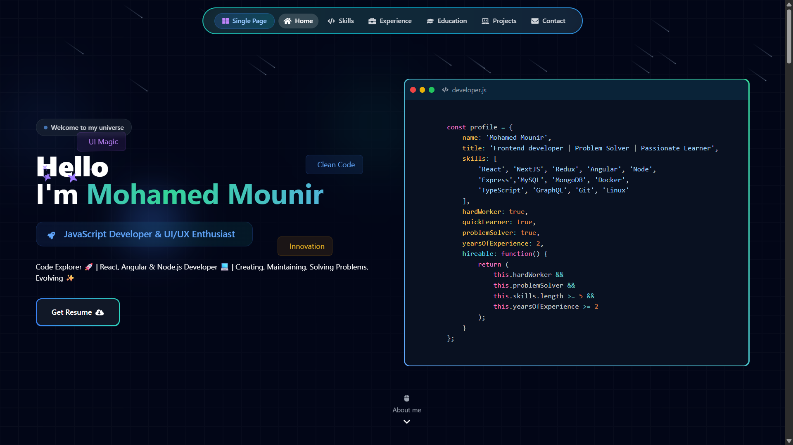
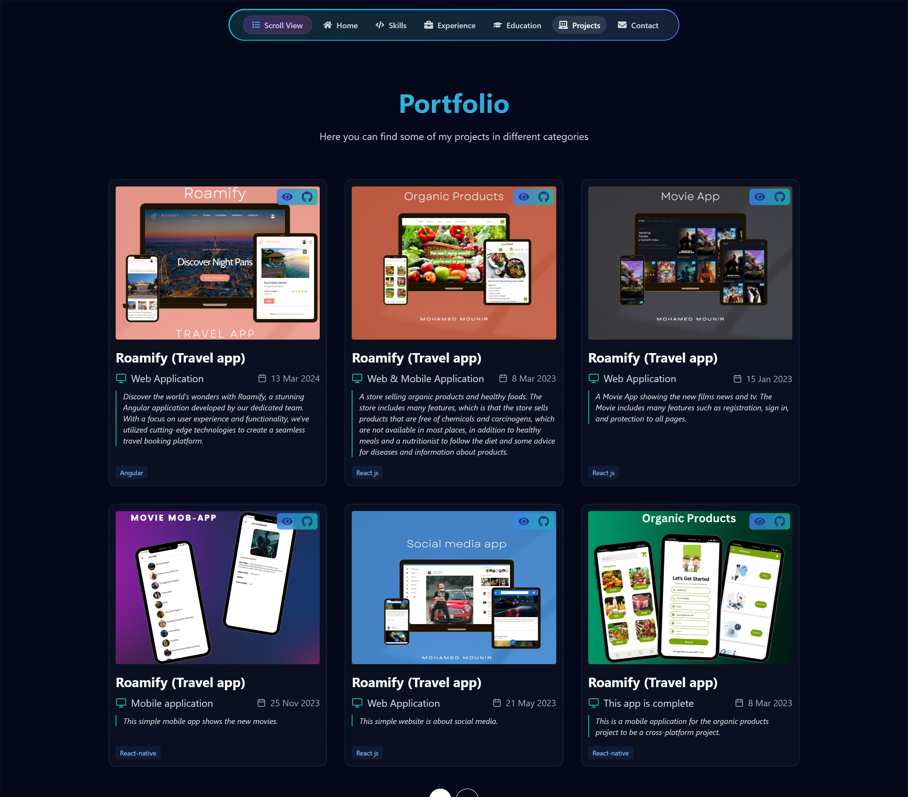
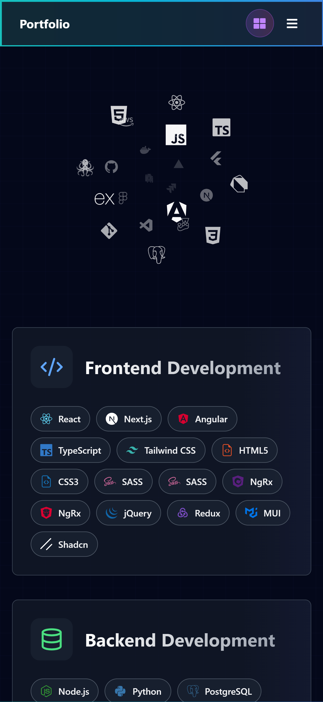
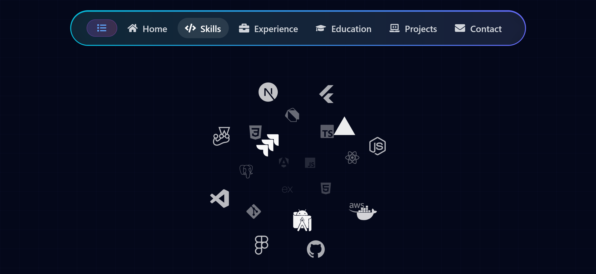

# 🚀 Mohamed Mounir - Portfolio

<div align="center">



[](https://reactjs.org/)
[](https://vitejs.dev/)
[](https://tailwindcss.com/)
[](https://www.typescriptlang.org/)

**A modern, responsive portfolio showcasing my skills, experience, and projects**

[Live Demo](https://vercel.com/mohamedmounir2425s-projects/mohamed_mounir-dev) • [View Resume](https://drive.google.com/file/d/1mIZ92lDm2y73AcHp3UwZLXTqJhaoRaoY/view) • [Contact Me](mailto:mohamed.mounir2425@gmail.com)

</div>

---

## ✨ Features

### 🎨 **Modern Design**

-   **Dark Theme**: Sleek dark interface with gradient accents
-   **Responsive Design**: Perfect on desktop, tablet, and mobile
-   **Smooth Animations**: Framer Motion powered animations
-   **Glassmorphism Effects**: Modern UI with backdrop blur effects

### 🧭 **Dual View Modes**

-   **Scroll Mode**: Traditional continuous scrolling through all sections
-   **Single Page Mode**: Focused view of one section at a time
-   **Toggle Button**: Easy switching between view modes with tooltips

<!-- ### 📱 **Interactive Elements**

-   **Smooth Scrolling Navigation**: Click header items to scroll to sections
-   **Active Section Highlighting**: Automatically highlights current section
-   **Mobile-Friendly Navigation**: Hamburger menu for mobile devices
-   **Tooltip System**: Helpful tooltips explaining features -->

### 🎯 **Portfolio Sections**

-   **Hero Section**: Animated introduction with code showcase
-   **Skills**: Interactive skills display with icons
-   **Experience**: Professional experience timeline
-   **Education**: Academic background and certifications
-   **Projects**: Portfolio of completed projects
-   **Contact**: Contact form with EmailJS integration

### ⚡ **Performance & UX**

-   **Fast Loading**: Vite-powered build for optimal performance
-   **SEO Optimized**: Meta tags and structured data
-   **Accessibility**: ARIA labels and keyboard navigation
-   **Cross-Browser Compatible**: Works on all modern browsers

---

## 🛠️ Technologies Used

### **Frontend Framework**

-   **React 18.3.1** - Modern React with hooks and functional components
-   **Vite 6.0.1** - Lightning-fast build tool and dev server

### **Styling & UI**

-   **Tailwind CSS 3.4.17** - Utility-first CSS framework
-   **Framer Motion 11.15.0** - Production-ready motion library
-   **React Icons 5.4.0** - Popular icon library
-   **Tailwind CSS Animate 1.0.7** - Animation utilities

### **Development Tools**

-   **ESLint 9.15.0** - Code linting and formatting
-   **PostCSS 8.4.49** - CSS processing
-   **Autoprefixer 10.4.20** - CSS vendor prefixing

### **Additional Libraries**

-   **Prism.js 1.29.0** - Syntax highlighting for code blocks
-   **EmailJS 4.4.1** - Contact form functionality
-   **React Router DOM 7.1.1** - Client-side routing
-   **Radix UI** - Accessible UI primitives

---

## 📸 Screenshots

<div align="center">

### Desktop View



### Mobile View




### Dark Theme


</div>

---

## 🚀 Getting Started

### Prerequisites

-   Node.js (version 16 or higher)
-   npm or yarn package manager

### Installation

1. **Clone the repository**

    ```bash
    git clone https://github.com/mohamedmounir2425/mohamed-mounir.dev
    cd portfolio
    ```

2. **Install dependencies**

    ```bash
    npm install
    # or
    yarn install
    ```

3. **Start the development server**

    ```bash
    npm run dev
    # or
    yarn dev
    ```

4. **Open your browser**
   Navigate to `http://localhost:5173`

### Build for Production

```bash
npm run build
# or
yarn build
```

### Preview Production Build

```bash
npm run preview
# or
yarn preview
```

---

## 📁 Project Structure

```
portfolio/
├── public/                 # Static assets
├── src/
│   ├── assets/            # Images, CSS, and other assets
│   │   ├── css/          # Global styles and animations
│   │   └── images/       # Image assets
│   ├── components/       # Reusable React components
│   │   ├── layout/       # Layout components (Header, etc.)
│   │   └── ui/           # UI components (buttons, cards, etc.)
│   ├── pages/            # Page components
│   │   ├── Hero/         # Hero section
│   │   ├── Skills/       # Skills section
│   │   ├── Experience/   # Experience section
│   │   ├── Education/    # Education section
│   │   ├── Portfolio/    # Projects section
│   │   └── Contact/      # Contact section
│   ├── lib/              # Utility functions and configurations
│   ├── data/             # Static data (skills, projects, etc.)
│   ├── App.jsx           # Main App component
│   └── main.jsx          # Application entry point
├── package.json          # Dependencies and scripts
├── tailwind.config.js    # Tailwind CSS configuration
├── vite.config.js        # Vite configuration
└── README.md             # Project documentation
```

---

## 🎨 Customization

### Colors & Theme

The portfolio uses a dark theme with customizable colors. Edit the Tailwind configuration:

```javascript
// tailwind.config.js
module.exports = {
    theme: {
        extend: {
            colors: {
                // Customize your color palette here
                primary: "#3B82F6",
                secondary: "#10B981",
                accent: "#8B5CF6",
            },
        },
    },
};
```

### Content Updates

-   **Personal Info**: Update `src/pages/Hero/Hero.jsx` with your information
-   **Skills**: Modify `src/data/skills.js` to add/remove skills
-   **Projects**: Update `src/data/projects.js` with your projects
-   **Experience**: Edit `src/data/experience.js` with your work history

### Styling

-   **Global Styles**: Edit `src/assets/css/index.css`
-   **Component Styles**: Use Tailwind classes or create custom CSS
-   **Animations**: Modify Framer Motion animations in components

---

## 📱 Responsive Design

The portfolio is fully responsive and optimized for:

-   **Desktop**: 1200px+ (Full layout with side-by-side content)
-   **Tablet**: 768px - 1199px (Adaptive layout)
-   **Mobile**: < 768px (Stacked layout with mobile navigation)

### Mobile Features

-   Hamburger menu navigation
-   Touch-friendly buttons and interactions
-   Optimized typography and spacing
-   Swipe gestures support

---

## 🔧 Configuration

<!-- ### Environment Variables

Create a `.env` file in the root directory:

```env
# EmailJS Configuration
VITE_EMAILJS_SERVICE_ID=your_service_id
VITE_EMAILJS_TEMPLATE_ID=your_template_id
VITE_EMAILJS_PUBLIC_KEY=your_public_key

# Analytics (optional)
VITE_GA_TRACKING_ID=your_ga_tracking_id
``` -->

### Deployment

The project is configured for deployment on Vercel. Simply connect your GitHub repository to Vercel for automatic deployments.

---

## 🤝 Contributing

Contributions are welcome! Please feel free to submit a Pull Request.

1. Fork the project
2. Create your feature branch (`git checkout -b feature/AmazingFeature`)
3. Commit your changes (`git commit -m 'Add some AmazingFeature'`)
4. Push to the branch (`git push origin feature/AmazingFeature`)
5. Open a Pull Request

---

## 📄 License

This project is licensed under the MIT License - see the [LICENSE](LICENSE) file for details.

---

## 📞 Contact

**Mohamed Mounir** - [LinkedIn](#) - [Email](mailto:mohamed.mounir2425@gmail.com)

**Portfolio Link**: [https://vercel.com/mohamedmounir2425s-projects/mohamed_mounir-dev](#)

**GitHub**: [https://github.com/mohamedmounir2425](https://github.com/mohamedmounir2425)

---

<div align="center">

### ⭐ Star this repository if you found it helpful!

Made with ❤️ by [Mohamed Mounir](https://github.com/mohamedmounir2425)

</div>
